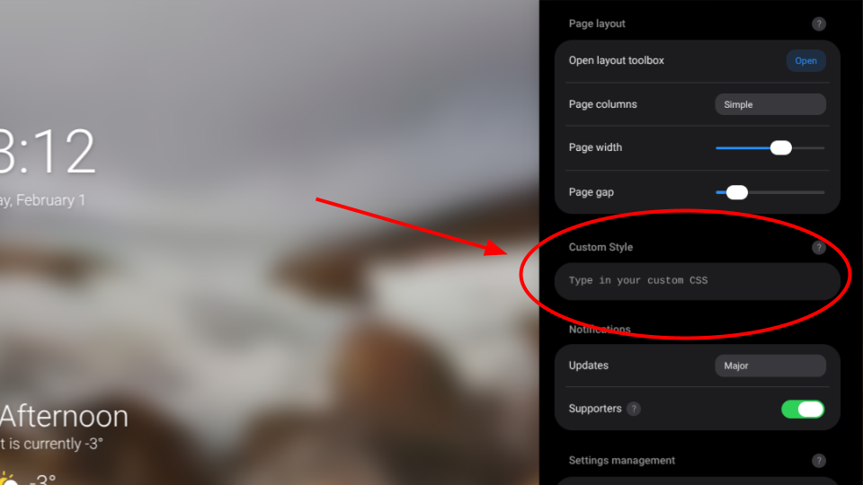
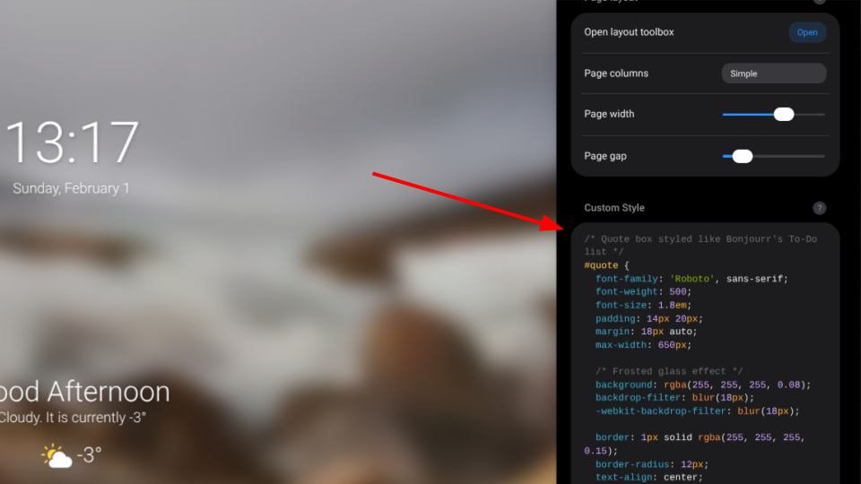
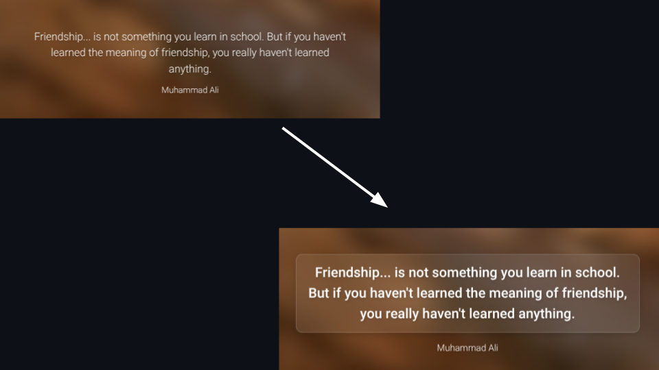

# bonjourr-quote-glassmorphism
Custom Bonjourr CSS that styles the quote widget to match native UI cards. Uses blur based glassmorphism, transparent layers, soft borders, and shadows. Hooks into Bonjourr IDs only. Lightweight, CSS only, and visually consistent with the Notes module.

# Usage
🔗 **CSS Source File**  
https://github.com/sarang-cmd/bonjourr-quote-glassmorphism/blob/main/custom-quote-box.css

---
## ✅ How to apply the quote box style in Bonjourr.

1. Open this file  
https://github.com/sarang-cmd/bonjourr-quote-glassmorphism/blob/main/custom-quote-box.css

2. Copy the full CSS code 📋

3. Open Bonjourr → Settings → General and **enable all settings** ⚙️


4. Open Bonjourr → Settings → Custom styles 🎨



5. Paste the CSS into the box  



6. Reload Tab 🔄

7. The quote widget updates instantly ✨



*No extensions. No scripts. CSS only.*

---

## Notes

- Works with Bonjourr default quote module 
- Matches Notes module glass style 
- Safe on light and dark wallpapers 

---

## Target Elements

Bonjourr exposes UI elements using fixed IDs.

- #quote  
  Main quote container rendered by Bonjourr.

- #quote-author  
  Author text injected inside the quote container.

No JavaScript is required.
All behavior is controlled through CSS.

---

## Full CSS

```css
/* Quote box styled like Bonjourr's Notes module */
#quote {
  font-family: 'Roboto', sans-serif;
  font-weight: 500;
  font-size: 1.8em;
  padding: 14px 20px;
  margin: 18px auto;
  max-width: 650px;

  /* Frosted glass effect */
  background: rgba(255, 255, 255, 0.08);
  backdrop-filter: blur(18px);
  -webkit-backdrop-filter: blur(18px);
  
  border: 1px solid rgba(255, 255, 255, 0.15);
  border-radius: 12px;
  text-align: center;
  color: #ffffff;
  box-shadow: 0 4px 12px rgba(0, 0, 0, 0.15);
}

/* Author line smaller, italic, highlighted subtly */
#quote-author {
  display: block;
  margin-top: 6px;
  font-family: 'Roboto', sans-serif;
  font-weight: 400;
  font-size: 0.75em;
  font-style: italic;
  opacity: 0.9;
  text-decoration: underline;
}
```

---

## Typography Control

```css
font-family: 'Roboto', sans-serif;
```

Roboto matches the default Bonjourr UI font.
This keeps visual consistency across widgets.

```css
font-weight: 500;
font-size: 1.8em;
```

Medium weight improves readability over blurred backgrounds.
em units scale with Bonjourr zoom and screen size.

---

## Layout Logic

```css
padding: 14px 20px;
margin: 18px auto;
max-width: 650px;
```

Padding creates spacing inside the card.
Auto margins center the element.
Max width limits line length on large screens.

---

## Glassmorphism Effect

This section mimics the Bonjourr Notes module.

```css
background: rgba(255, 255, 255, 0.08);
```

Low opacity white simulates frosted glass.
The wallpaper remains visible.

```css
backdrop-filter: blur(18px);
-webkit-backdrop-filter: blur(18px);
```

The blur samples pixels behind the element.
Safari requires the prefixed version.
The blur value matches Bonjourr Notes cards.

```css
border: 1px solid rgba(255, 255, 255, 0.15);
border-radius: 12px;
```

The border defines edges on bright backgrounds.
The radius aligns with Bonjourr component curvature.

```css
box-shadow: 0 4px 12px rgba(0, 0, 0, 0.15);
```

A soft shadow separates the card from the wallpaper.
This prevents visual flattening.

---

## Text and Contrast

```css
text-align: center;
color: #ffffff;
```

Center alignment fits quote formatting.
White text maintains contrast on dark images.

---

## Author Styling

```css
display: block;
margin-top: 6px;
```

Forces the author onto a new line.
Creates separation from the quote text.

```css
font-size: 0.75em;
font-style: italic;
opacity: 0.9;
```

Smaller size establishes hierarchy.
Italic styling signals attribution.
Slight opacity reduces visual weight.

```css
text-decoration: underline;
```

Optional emphasis.

---

## Image Caption Ideas

- Quote box with glass blur over wallpaper
- Visual match with Bonjourr Notes module
- Blur clarity on bright background
- Blur clarity on dark background
- Typography hierarchy between quote and author
- Border and shadow detail close up

---

## Result

The quote widget visually integrates into Bonjourr.
The effect stays lightweight and CSS only.
No layout conflicts occur.
